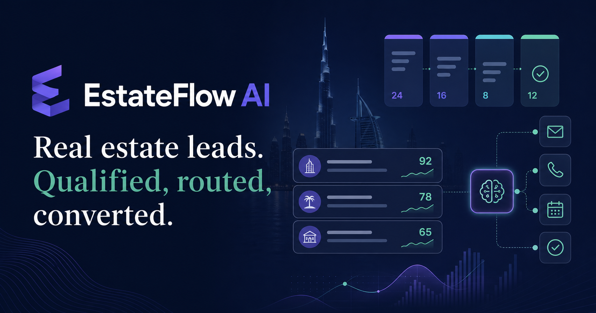
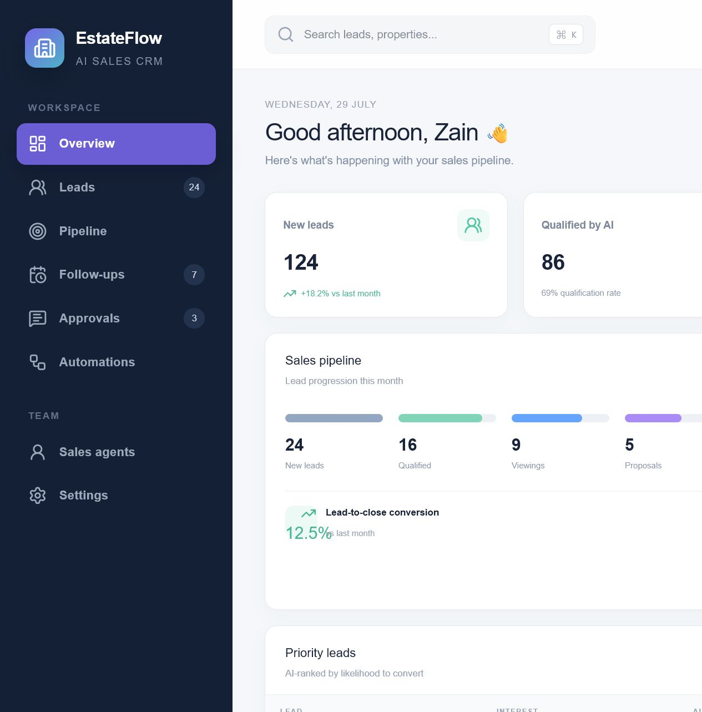
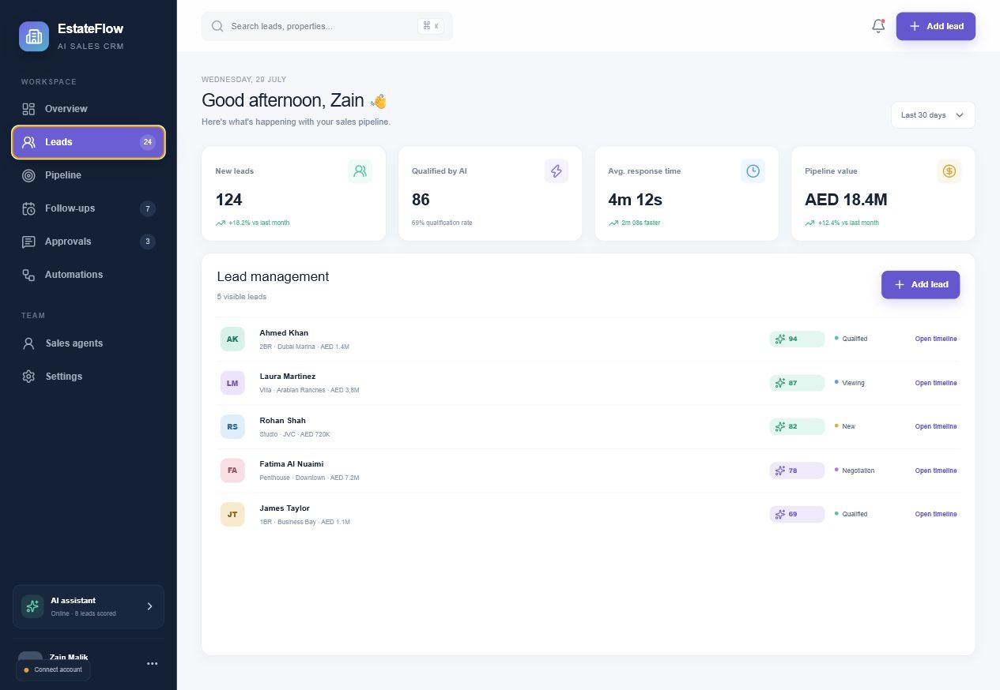
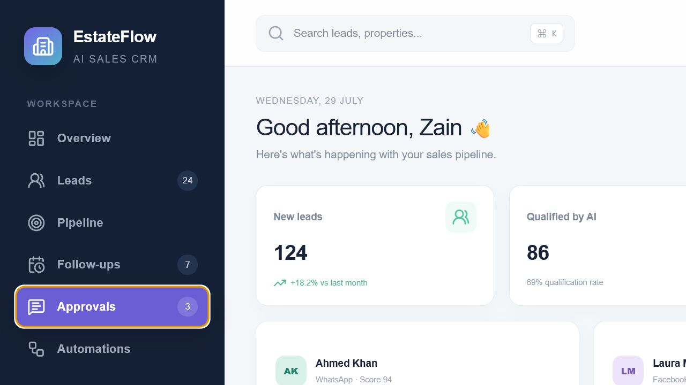
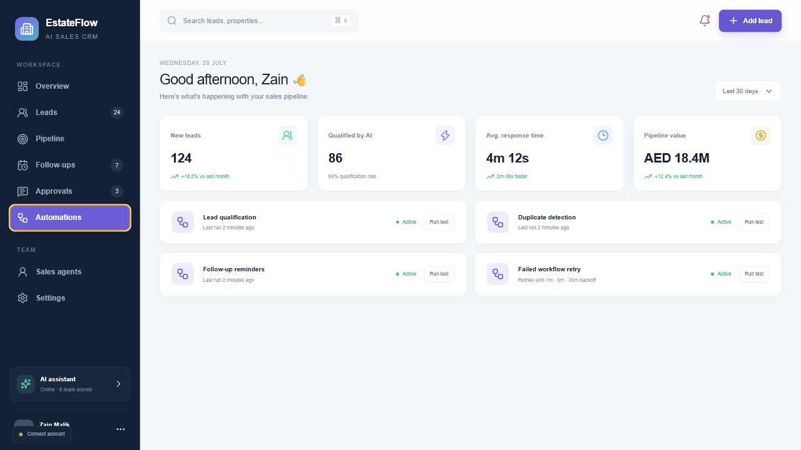
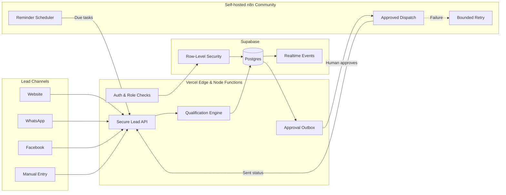
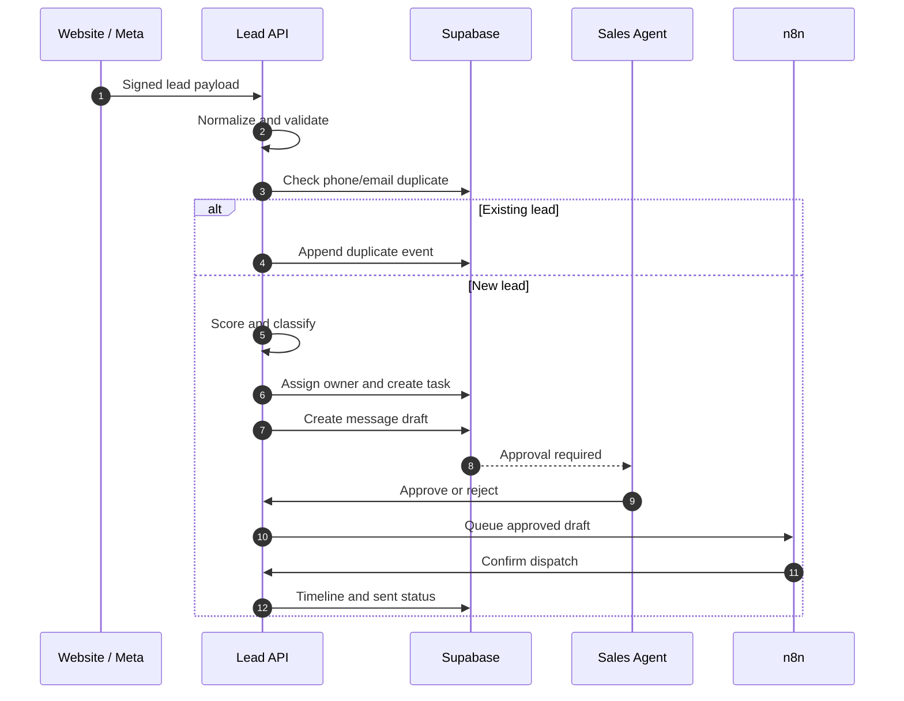
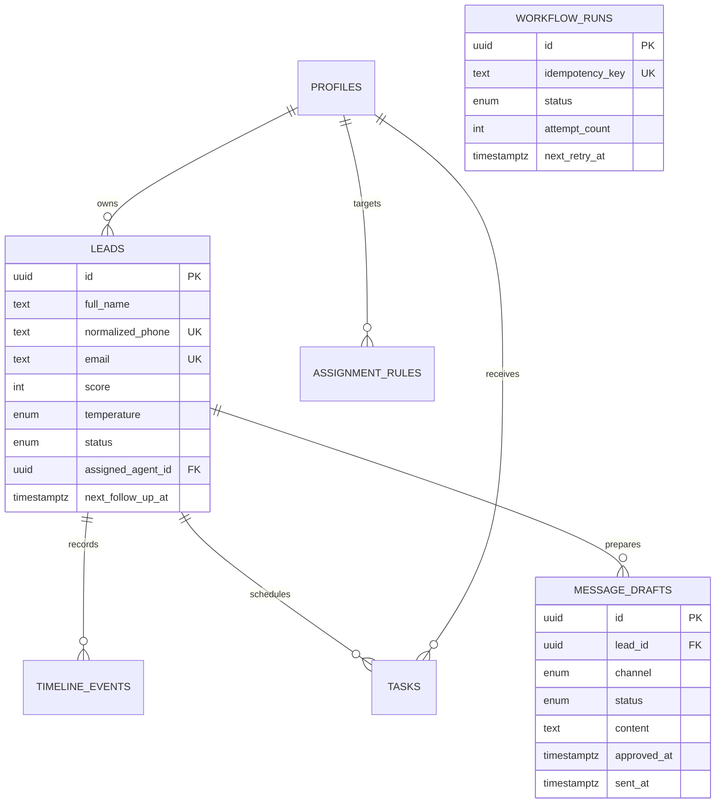

<div align="center">

# EstateFlow AI

### AI Sales CRM & Automation Platform for Dubai Real Estate

Capture every lead. Qualify instantly. Follow up intelligently. Close more deals.

[](https://ai-real-estate-crm-green.vercel.app/)
[](https://github.com/M-Arslan-Bhatti/ai-real-estate-crm)


</div>



## The product

EstateFlow is a production-minded CRM for real-estate sales teams. Website, WhatsApp and Facebook enquiries enter one secure pipeline where they are normalized, deduplicated, scored, assigned and prepared for follow-up.

Every outbound message stays in a human-approval queue. Every important action becomes part of the lead timeline. Failed automation runs are recorded and retryable instead of silently losing a prospect.

> Built around a real Dubai property-agency workflow—not a collection of disconnected dashboard cards.

## What it solves

| Sales problem | EstateFlow response |
|---|---|
| Leads scattered across channels | Signed API and webhook intake |
| Duplicate prospects in spreadsheets | Phone and email normalization with unique constraints |
| Agents guessing which lead to call first | Explainable 0–100 qualification score |
| Uneven salesperson workload | Rule-based assignment with workload fallback |
| Slow or forgotten follow-ups | Due tasks and n8n reminder orchestration |
| Risky fully automatic messaging | Mandatory approve, edit or reject gate |
| Automation failures hidden from the team | Idempotent workflow runs, error state and retry |
| No visibility into conversion | Source, pipeline and conversion dashboards |

## Product tour



<table>
  <tr>
    <td width="50%"><br/><b>Lead management</b><br/>Prioritize every prospect by owner, score, status and property interest.</td>
    <td width="50%"><br/><b>Human approval queue</b><br/>Review generated follow-ups before anything is sent.</td>
  </tr>
  <tr>
    <td colspan="2"><br/><b>Automation health</b><br/>See qualification, duplicate detection, reminders and retry status in one place.</td>
  </tr>
</table>

## End-to-end architecture



## Lead lifecycle



## Core capabilities

- Secure lead capture through API/webhooks
- Deterministic, explainable lead qualification
- Phone and email duplicate prevention
- Automatic salesperson assignment
- Follow-up task and message-draft generation
- Human approval before outbound dispatch
- Complete lead timeline
- Retry-safe n8n workflow orchestration
- Admin and sales-agent authorization
- Supabase RLS and server-only elevated credentials
- Responsive dashboard, tables and Kanban pipeline
- Zero-paid-service portfolio deployment

## Technology

| Layer | Technology |
|---|---|
| Interface | React 19, TypeScript, Vite/Vinext, Tailwind CSS |
| Hosting | Vercel Hobby |
| API | Vercel Node.js Functions |
| Database | Supabase Postgres |
| Authentication | Supabase Auth |
| Authorization | Postgres Row-Level Security |
| Automation | n8n Community Edition with Docker |
| AI strategy | Explainable rules; optional LLM adapter |
| CI/CD | GitHub + automatic Vercel deployments |

## Qualification model

The free showcase uses deterministic business rules, so every score is stable, testable and explainable. An LLM can later extract free-form intent without becoming the final decision-maker.

```text
Premium/active budget fit  → up to 25 points
Urgent purchase timeline   → up to 25 points
Preferred area supplied    → 10 points
Property type supplied     →  8 points
Complete contact details   → 12 points
Base qualification         → 20 points
```

| Score | Temperature | Recommended response |
|---:|---|---|
| 80–100 | Hot | Call within 15 minutes |
| 55–79 | Warm | Follow up today |
| 0–54 | Cold | Add to nurture sequence |

## API example

```bash
curl -X POST https://ai-real-estate-crm-green.vercel.app/api/leads \
  -H "Content-Type: application/json" \
  -H "X-CRM-Webhook-Secret: $CRM_WEBHOOK_SECRET" \
  -d '{
    "full_name": "Sara Khan",
    "phone": "+971501234567",
    "source": "website",
    "budget": 1500000,
    "timeline": "immediate",
    "area": "Dubai Marina",
    "property_type": "Apartment"
  }'
```

The endpoint returns the created lead or the existing record when a duplicate is detected.

## Data model



## Run locally

```bash
git clone https://github.com/M-Arslan-Bhatti/ai-real-estate-crm.git
cd ai-real-estate-crm
npm install
copy .env.example .env.local
npm run dev
```

Public configuration:

```env
NEXT_PUBLIC_SUPABASE_URL=
NEXT_PUBLIC_SUPABASE_PUBLISHABLE_KEY=
```

Server-only configuration:

```env
SUPABASE_SECRET_KEY=
CRM_WEBHOOK_SECRET=
N8N_WEBHOOK_URL=
N8N_WEBHOOK_SECRET=
```

Never place server secrets in variables prefixed with `NEXT_PUBLIC_`.

## Run n8n locally

```bash
cd n8n
copy .env.example .env
docker compose up -d
```

Open `http://localhost:5678`, create the owner account and import the credential-free JSON files from [`n8n/workflows`](n8n/workflows). Channel credentials belong inside n8n and are intentionally excluded from Git.

## Quality gates

```bash
npm run lint
npm test
npm run build:vercel
docker compose -f n8n/docker-compose.yml --env-file n8n/.env.example config --quiet
```

## Security design

- Service-role credentials stay in Vercel server environments
- RLS limits agents to assigned leads and tasks
- Webhook and workflow endpoints require separate secrets
- Approval and dispatch are separate operations
- An approved draft cannot be dispatched twice with the same idempotency key
- Duplicate constraints also exist at database level
- Workflow errors preserve retry time and attempt count
- Demo fixtures contain no real customer information

## Zero-cost deployment

The live CRM uses Vercel Hobby and Supabase Free. n8n is provided as a self-hosted Community Edition Docker deployment, so the repository remains usable without a paid n8n Cloud subscription. A production agency can run that container on infrastructure it already owns.

## Roadmap

- Meta webhook verification and test lead adapter
- WhatsApp Cloud API delivery/read receipts
- Arabic and English message templates
- Live agent availability and round-robin controls
- Property inventory matching
- CI integration tests against an isolated Supabase project

## Author

Built by **Muhammad Arslan** as a full-stack AI automation and DevOps portfolio project.

If this project is useful, consider giving the repository a star.

## License

MIT
