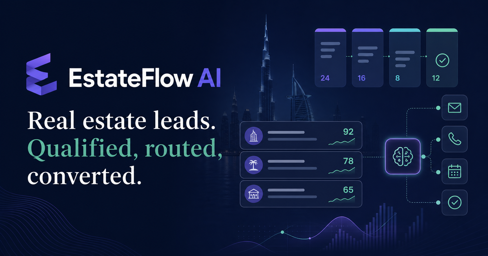
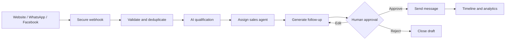

# EstateFlow AI

> Real estate leads. Qualified, routed, converted.

EstateFlow is a production-minded AI sales CRM built for Dubai real-estate teams. It captures leads from websites, WhatsApp and Facebook, detects duplicates, qualifies prospects, assigns the right agent and creates human-approved follow-ups.



## Why this exists

High-intent property leads go cold quickly. Teams often copy leads between ad platforms, spreadsheets and messaging apps, which creates duplicate records, slow responses and missed follow-ups. EstateFlow turns that fragmented process into one observable workflow.

## Product highlights

- Multi-channel lead capture through signed webhooks
- Explainable AI qualification and scoring
- Exact and fuzzy duplicate detection
- Skill, language and workload-based assignment
- AI-generated WhatsApp and email follow-ups
- Mandatory human approval before sending
- Append-only lead activity timeline
- Scheduled reminders and retryable n8n workflows
- Conversion, response-time and source analytics
- Admin and sales-agent access boundaries

## Human-in-the-loop flow



## Stack

- React 19, TypeScript and Vinext/Vite
- Tailwind CSS
- Cloudflare D1 with Drizzle ORM for the deployable showcase
- Supabase/Postgres target architecture for the full CRM service
- OpenAI-compatible LLM with structured JSON output
- n8n for reminders, escalation and retry orchestration
- Meta WhatsApp Cloud API and Facebook Webhooks adapters
- GitHub Actions and AWS-ready infrastructure plan

## AI qualification contract

The LLM returns a strict object containing score, intent, budget, preferred locations, property type, purchase timeline, summary, recommended next action and confidence. The final score combines model extraction with deterministic business rules, keeping the result reviewable.

```text
40% budget fit
25% purchase timeline
15% property/location match
10% contact completeness
10% intent confidence
```

## Data model

The checked-in schema includes profiles, leads, timeline events, approval-based message drafts and idempotent workflow runs. Every sales event can be traced back to a lead, actor and timestamp.

## Run locally

```bash
npm install
npm run dev
```

Copy `.env.example` to `.env.local` only when connecting external services. The visual demo works without third-party credentials.

## Quality checks

```bash
npm run build
npm run lint
npm test
```

## Security

- Elevated database and LLM keys are server-only
- Webhook signatures are verified before processing
- Outbound sends require an approved draft
- Workflow calls use idempotency keys
- Roles are enforced on the server and database
- Personal data is excluded from logs and demo fixtures

## Automation

Import the JSON files in `n8n/workflows` into n8n. Production workflows use separate credentials and environment variables; no secrets are committed.

## Deployment

The showcase is compatible with OpenAI Sites. The production architecture can place the frontend behind CloudFront, the API on AWS App Runner, containers in ECR, secrets in Secrets Manager and logs in CloudWatch, while Supabase remains the system of record.

## Roadmap

- Live Supabase project and RLS policies
- Meta Business webhook verification
- WhatsApp delivery/read receipts
- Agent availability calendar
- Property inventory matching
- Arabic and English follow-ups
- Sentry and product analytics

## License

MIT
