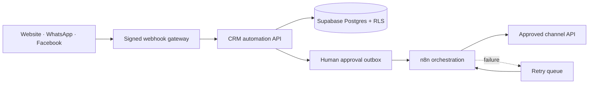

# EstateFlow architecture

EstateFlow separates channel intake, business logic, durable data, human approval and automation delivery.

## Design decisions

- Incoming channel payloads are normalized before entering the domain model.
- Duplicate detection runs before qualification and assignment.
- Qualification is deterministic and explainable in the free showcase.
- Assignment uses explicit rules with workload-based fallback.
- Generation and sending are separate operations.
- Outbound drafts require human approval.
- Timeline records provide a complete audit trail.
- Workflow calls use unique idempotency keys.
- Secrets never enter the browser bundle or repository.

## Deployment boundaries

- Vercel serves the static React interface and Node.js API functions.
- Supabase provides authentication, Postgres, RLS and realtime events.
- n8n Community Edition runs from the checked-in Docker Compose definition.
- WhatsApp/Facebook channel credentials are optional and remain inside n8n.
